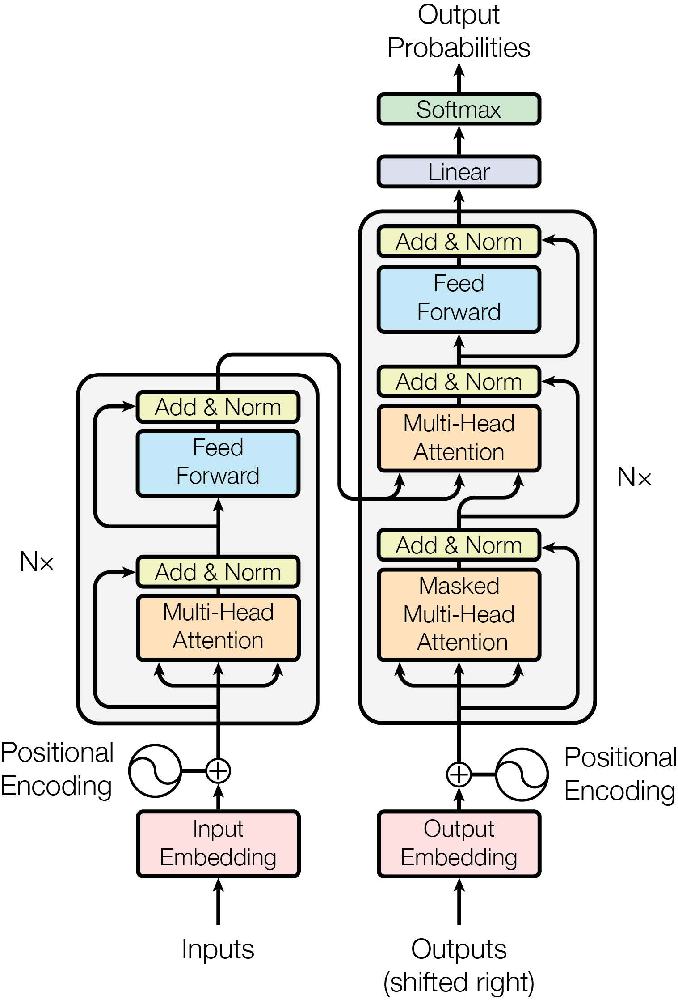

# 一级标题

## 二级标题

### 三级标题

#### 四级标题

##### 五级标题

###### 六级标题

> 引用块

建议引用块

警示引用块

笔记引用块

表格

| col1 | col2 | col3 |
| ---- | ---- | ---- |
| 1    | 2    | 3    |
| 4    | 5    | 6    |
| 7    | 8    | 9    |

图片

列表

1. item1
2. item2
3. item3

